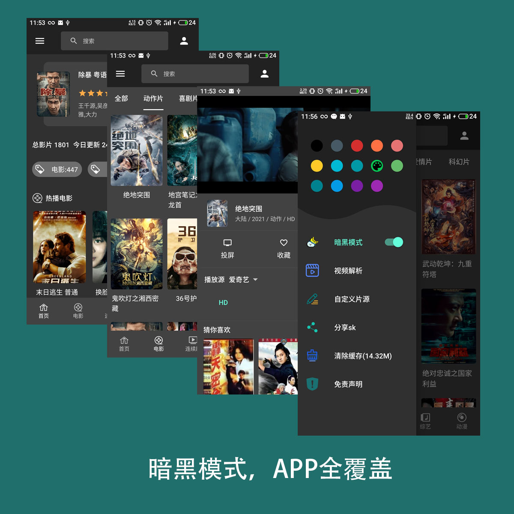
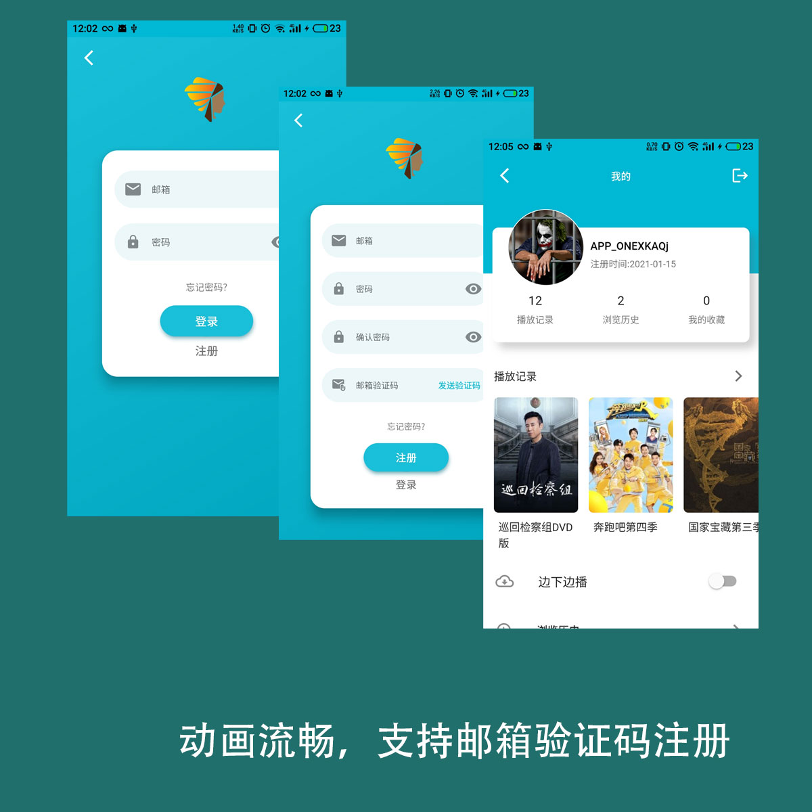
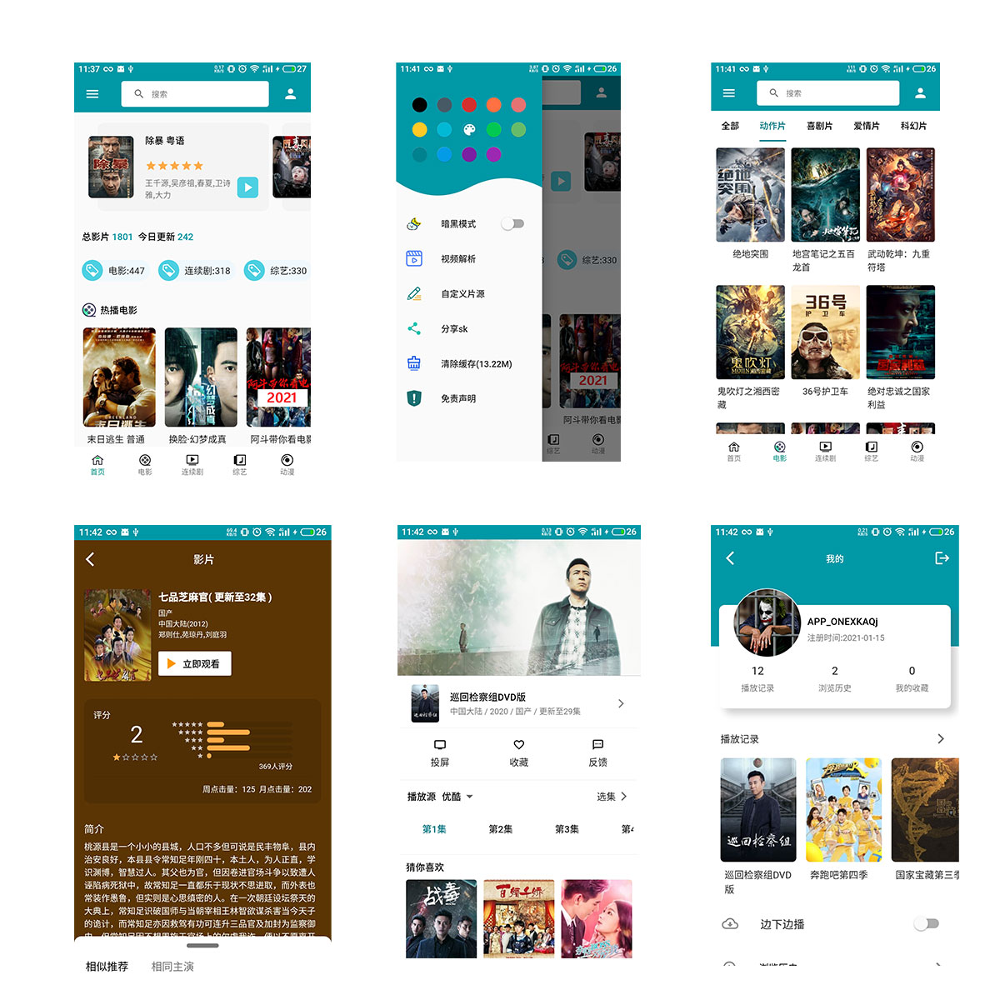

## skapp

此APP从2020年初就开始编写，优化、优化、再优化，提交次数接近200次，不愿意放过任何一个细节，夜以继日的编码只为了更好的用户体验。目前项目还在持续开发中。

此APP直接操作苹果cms数据库，所以你只需要一个数据库就可完美运行。所有配置都在yaml文件中操作，提供APP端个性化配置。

## 淘宝店铺直达

https://item.taobao.com/item.htm?spm=a2oq0.12575281.0.0.50111debmvIFBe&ft=t&id=637993247789

## 联系邮箱

1768385508@qq.com

## apk演示版：

链接: https://pan.baidu.com/s/1QLUj_UnB3iTGFbzu4s6hHA 提取码: 1wfr

链接：https://sk.ncer.top/assets/app/app-release.apk

## ios演示版（ipa文件需要自行签名安装）：
链接: https://pan.baidu.com/s/123MbGh7hKWDpSsfZZiKz2w 提取码: 2tq9

链接：https://sk.ncer.top/assets/app/Payload.ipa

- 1.原生体验，纵享丝滑，

- 2.流畅的动画，随处可见的骨架屏，让app等待也不再枯燥，拒绝弹出框形式的loading

- 3.主题换肤，app端内置了14个精心挑选的主题颜色，app初始安装默认颜色可在后端配置，用户在安装后也可自行选择自己心怡的颜色。

- 4.暗黑模式，晚上就要用晚上的颜色，做到暗黑全覆盖，

- 5.强大的解析能力，支持mp4，m3u8，avi，rmtp，rtmp协议，支持vip视频解析播放，爱奇艺，优酷，腾讯，芒果，BiliBili等等，支持webview形式的视频嵌套。

- 6.API加密，让你的数据更安全，密钥可在后端配置，

- 7.支持邮箱验证码形式的注册，支持投屏、边下边播

## 目前APP支持的功能主要有：

- 1.主题换肤，暗黑模式

- 2.登录、注册、邮箱验证码发送

- 3.视频列表，视频分类，搜索

- 4.视频播放，倍速，选集，暂停，锁屏，全屏，声音及亮度手势调节，会员视频解析

- 5.猜你喜欢，相同演员影片推荐

- 6.我的浏览记录，播放记录（可存播放进度），收藏记录，播放反馈

- 7.穿山甲及图片两种广告形式接入

- 8.API加密

- 9.投屏，边下边播

- 10.分享APP

- 11.APP在线更新

- 12.友盟统计

- 13.自定义片源

- 14.图片存储链接转换

## 可配置项：

- 1.APP默认颜色

- 2.邮箱服务器配置

- 3.是否必须登录

- 4.api加密密钥

- 5.左侧选项是否显示及显示配置

- 6.广告接入形式

- 7.视频解析接口地址

- 8.图片大小设置，节省CDN流量

## 部分截图

